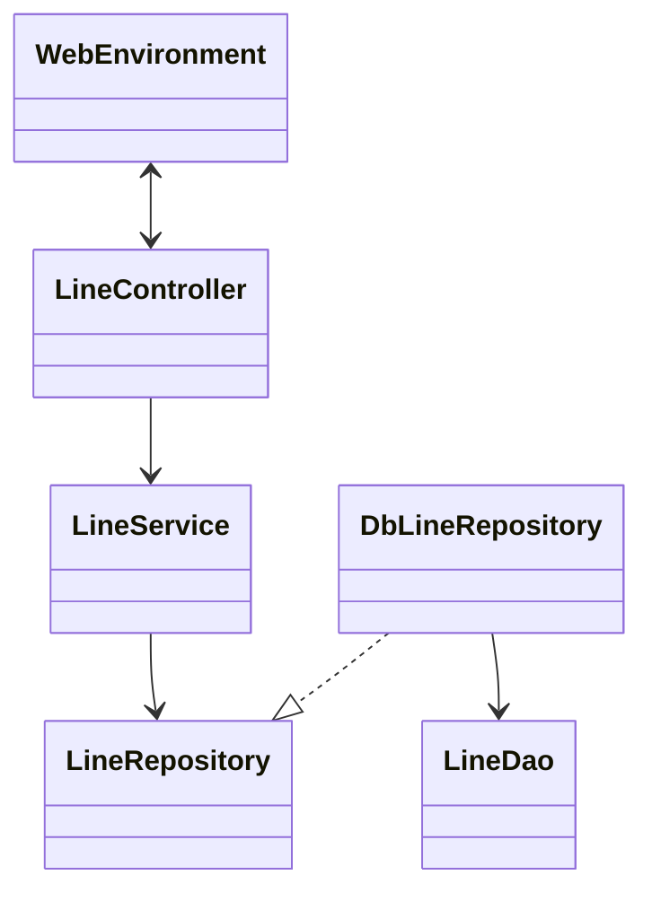
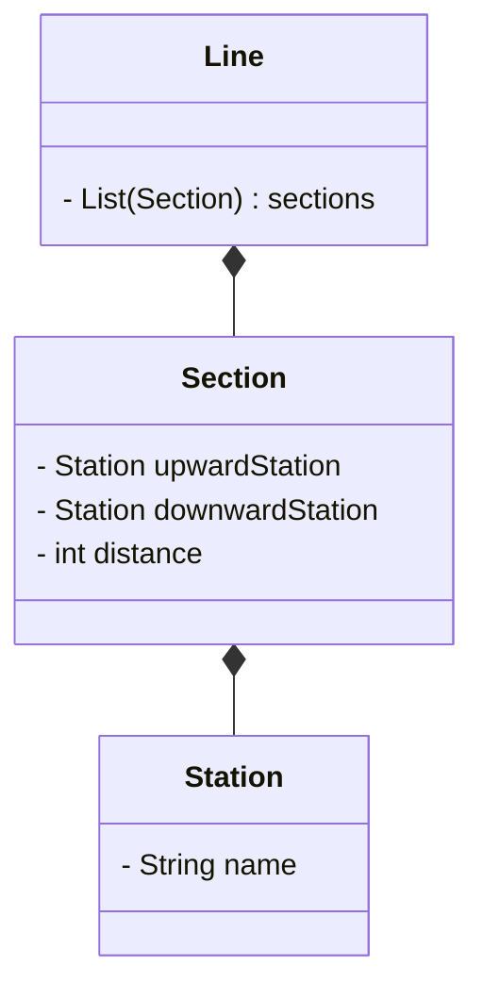
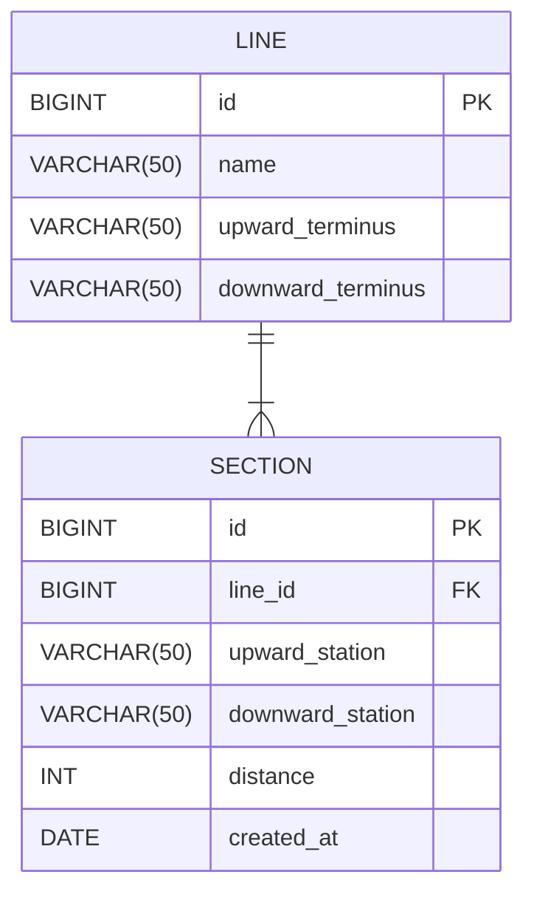

# 프로그램 개요
지하철 노선도를 관리하는 프로그램입니다.
노선과 역을 추가, 제거할 수 있습니다.
## 용어 설명
- 역 : 노선을 따라 지정된 지점
- 노선 : 여러 역이 연결된 경로
- 구간 : 역과 역 사이


# 프로그램 설계

### 클래스 다이어그램 - MVC


### 클래스 다이어그램 - 도메인


### Entity-Relationship Diagram


# API 명세서

### ✅ POST /lines
- 노선을 추가합니다. 
- 종점이 될 역 2개와 거리를 설정해야 합니다.
- 존재하지 않는 역이면, 새로 생성됩니다.

#### Request example
```text
POST /lines HTTP/1.1
Content-type: application/json; charset=UTF-8
Host: localhost:8080
```
```json
{
    "name": "2호선",
    "upward_terminus": "잠실역",
    "downward_terminus": "몽촌토성역",
    "distance": 5
}
```

#### Response example
```text
HTTP/1.1 201 CREATED
Content-Type: application/json
Location: /lines/1
```

### ✅ POST /lines/{line_id}/station
- 노선에 역 한 개를 등록합니다.
- 노선의 id를 URI에 포함해서 요청해야 합니다.
- 존재하지 않는 역인 경우, 새로운 역을 생성합니다.

#### Request example
```text
POST /lines/1/station HTTP/1.1
Content-type: application/json; charset=UTF-8
Host: localhost:8080
```
```json
{
    "station": "잠실역",
    "adjacent_station": "몽촌토성역",
    "add_direction": "상행", // "상행" 또는 "하행" 입력
    "distance": 3
}
```

#### Response example
```text
HTTP/1.1 200 OK
Content-Type: application/json
```

### ✅ Delete /lines/{line_id}/station
- 노선에 포함된 역 한 개를 제외합니다.
- 해당 역이 더이상 어떤 노선에도 포함되지 않으면, 해당 역을 삭제합니다.
- 노선에 포함된 역이 2개뿐이라면, Status 401을 반환합니다.

#### Request example
```text
DELETE /lines/1/station HTTP/1.1
Content-type: application/json; charset=UTF-8
Host: localhost:8080

{
    "station": "잠실역"
}
```

#### Response example
```text
HTTP/1.1 200 OK
Content-Type: application/json
```

### ✅ GET /lines/{line_id}
- 특정 노선의 이름과 포함된 모든 역을 조회합니다.

#### Request example
```text
GET /lines/1 HTTP/1.1
Content-type: application/json; charset=UTF-8
Host: localhost:8080
```

#### Response example
```text
HTTP/1.1 200 OK
Content-Type: application/json
```
```json
{
    "name" : "2호선",
    "stations": ["몽촌토성역", "잠실역"]
}
```

### ✅ GET /lines
- 모든 노선의 정보를 조회합니다.
  - 노선의 정보는 노선의 이름과 포함된 모든 역의 이름을 가지고 있습니다.

#### Request example
```text
GET /lines HTTP/1.1
Content-type: application/json; charset=UTF-8
Host: localhost:8080
```

#### Response example
```text
HTTP/1.1 200 OK
Content-Type: application/json
```

```json
[
    {
        "name" : "2호선",
        "stations": ["몽촌토성역", "잠실역"]
    },
    {
        "name" : "3호선",
        "stations": ["수서역", "양재역, 잠실역"]
    },
    {
        "name" : "4호선",
        "stations": ["사당역", "삼각지역"]
    }
]
```

### ✅ GET /path?sourceStationID={sourceStationId}&destStationID={destStationId}
- 역과 역 사이의 최단 거리를 구합니다.

#### Request example
```text
GET /lines HTTP/1.1
Content-type: application/json; charset=UTF-8
Host: localhost:8080
```

#### Response example
```text
HTTP/1.1 200 OK
Content-Type: application/json
```

```json
{
  "stationNamesOfShortestPath": [
    "강남역",
    "역삼역",
    "잠실역"
  ],
  "totalDistance": 20,
  "totalFare": 500
}
```

# 기능 목록

### SubwayGraph
- [ ] 역과 역 사이의 최단 거리를 구한다.
- [ ] 역과 역 사이 최단 거리 루트(역 리스트)를 구한다.

### FareCalculator
- [ ] 역과 역 사이를 최단 거리로 통행하는데 필요한 요금을 구한다.
  - [ ] 거리가 10km 이하이면 기본 요금(1250)을 반환한다.
  - [ ] 거리가 10km 초과이면서 50km 이하라면 5km마다 100원을 추가한다. 
  - [ ] 거리가 50km 초과이면 8km마다 100원을 추가한다.
```
9km = 1250원
12km = 10km + 2km = 1350원
16km = 10km + 6km = 1450원
58km = 10km + 40km + 8km = 2150원
```

### Line
- [x] 노선을 생성한다.
  - [x] 구간을 생성한다.
- [x] 노선에 역을 추가한다.
  - [x] 예외) 이미 역이 존재하는 경우
  - [x] 예외) 이웃역이 존재하지 않을 경우
  - [x] 역이 위치할 곳의 구간을 생성한다.
    - [x] 예외) 새로운 구간의 거리가 기존 구간의 거리보다 크거나 같은 경우
- [x] 노선에서 역을 제거한다.
  - [x] 예외) 노선에 존재하지 않는 역인 경우
  - [x] 예외) 노선에 2개의 역만 존재하는 경우
  - [x] 구간을 새로 생성한다.
    - [x] 제거한 역이 포함된 구간을 노선에서 삭제한다.
      - [x] 역이 종점인지 아닌지 판단한다.
        - [x] 제거한 역이 종점역이 아닌 경우, 이웃하고 있던 두 역이 포함된 구간을 노선에 추가한다.

### Section
- [x] 상행역, 하행역과 거리를 갖는다.
- [x] 남은 거리를 계산한다.
- [x] 특정 역의 포함 여부를 반환한다.
- [x] 상행역인지 여부를 반환한다.
- [x] 하행역인지 여부를 반환한다.

### Station
- [x] 역의 이름을 갖는다.
