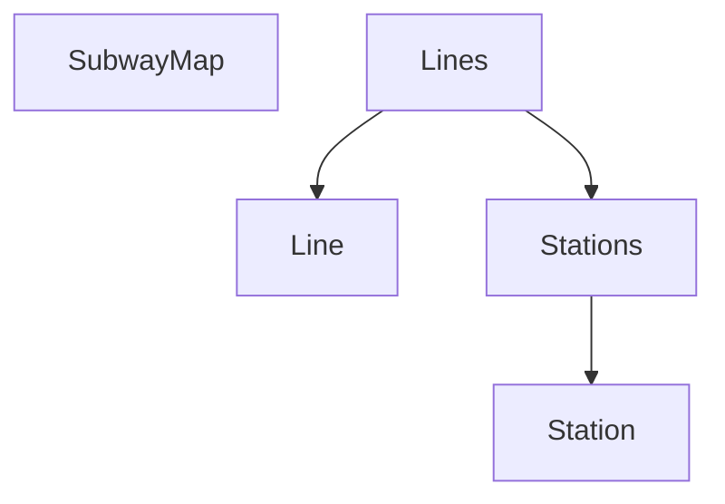

# jwp-subway-path

# 기능 요구사항

- [ ] 노선에 역 등록 API
  - [ ] 노선에 역이 등록될 때 거리 정보도 함께 포함되어야 합니다.
    - 두 역 사이에 역을 추가할 때, 
  - [ ] 노선에 역이 하나도 등록되지 않은 상황에서 최초 등록 시 두 역을 동시에 등록해야 합니다.
  - [ ] 노선은 갈래길을 가질 수 없습니다.

- [ ] 노선에 역 제거 API
  - [ ] 노선에서 역이 제거될 경우 역과 역 사이의 거리도 재배정되어야 합니다.
  - [ ] 노선에 등록된 역이 2개 인 경우 하나의 역을 제거할 때 두 역이 모두 제거되어야 합니다.

- [ ] 노선 조회 API 수정
  - [ ] 노선에 포함된 역을 순서대로 보여준다.
- [ ] 노선 목록 조회 API 수정
  - [ ] 존재하는 노선들을 보여준다.

---

# API 설계

## 단일 노선 조회

```http request
GET "/lines/{lineId}"

// List<StationResponse>
HTTP Status : 200 OK
```
```java
public class LineResponse {
    int id;
    String name;
    String color;
    List<StationResponse> stations;
}
```

## 노선 목록 조회

```http request
GET "/lines"

// List<LineResponse>
HTTP Status : 200 OK
```

## 노선에 초기 역 추가

```http request
POST "/lines/{lineId}"

Location: "/lines/{lineId}"

CREATED 201
```
```java
public class InitStationAddRequest {
    Long upStationId;
    Long downStationId;
    int distance;
}
```

## 노선에 역 1개 추가

```http request
POST "/lines/{lineId}/stations"

Location: "/lines/{lineId}"

CREATED 201
```

```java
public class StationAddRequest {
    Long newStationId;
    Long upStationId;
    Long nextStationId;
    int upStationDistance;
    int downStationDistance;
}
```

## 노선에 역 제거

```http request
DELETE "/lines/{lineId}/stations/{stationId}"

HTTP Status : 204 NO Contentent
```

---

# DB TABLE 설계
```mysql
CREATE TABLE STATION
(
  id   BIGINT NOT NULL AUTO_INCREMENT,
  name VARCHAR(255) NOT NULL UNIQUE,
  PRIMARY KEY (id)
);

CREATE TABLE LINE
(
  id    BIGINT AUTO_INCREMENT NOT NULL,
  name  VARCHAR(255)          NOT NULL UNIQUE,
  color VARCHAR(255)          NOT NULL UNIQUE,
  PRIMARY KEY (id)
);

CREATE TABLE SECTION
(
    id         BIGINT AUTO_INCREMENT NOT NULL,
    line_id    BIGINT,
    previous_station_id BIGINT,
    next_station_id BIGINT,
    distance INT NOT NULL,
    PRIMARY KEY (id),
    FOREIGN KEY (line_id) REFERENCES LINE (id) ON DELETE CASCADE,
    FOREIGN KEY (previous_station_id) REFERENCES STATION (id) ON DELETE CASCADE,
    FOREIGN KEY (next_station_id) REFERENCES STATION (id) ON DELETE CASCADE
);
```

---


