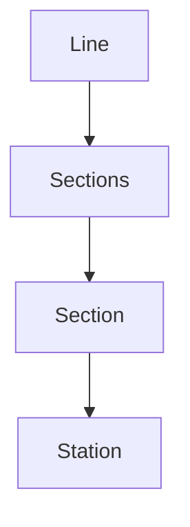

# jwp-subway-path

## 도메인

### Line

- Long:id
- String:name
- Sections:sections

### Sections

- List<Section> sections

### Section

- Long:id
- Station:upStation
- Station:downStation
- int:distance

### Station

- Long:id
- String:name

## 요구사항

### 등록 API 신규 구현

- [ ] 역 생성
    - name
- [ ] 라인 생성
    - name
    - 이름이 존재하면 예외처리
- [ ] 구간 생성
    - lineId
    - upStationId
    - downsStationId
    - distance
    - 처음인경우나 종점인 경우 그냥 생성하면 됨
        - upStation, downStation 둘다 맞는 section이 없는 경우
    - 중간에 넣는 경우
        - 넣는 역이 downStation인 경우
            - upStation으로 Section을 찾아 downStation을 넣는역으로 update
            - distance도 새로운 distance로 변경
            - 넣은 역과 원래 downStation역을 이어주는 Section을 생성, distance는 (원래 distance - 넣은 distance)
        - 넣는 역이 upStation인 경우 위와 반대로하면 됨

### 제거 API 신규

- [ ] 역 제거
    - 종점인 경우 (한쪽 station만 있는 경우) station과 함께 제거
    - 중간역 제거하는 경우 좌, 우 제거한 후 합친 새로운 section 연결해줌
- [ ] 라인 제거
- [ ] 구간 제거

### 노선 조회 API 수정

- [ ] 노선에 포함된 역 순서대로 조회
    - section 돌면서 upStation +1, downStation -1 map에 기록하면서 동시에 인접노드도 map<station, list<station>>으로 기록
    - 점수가 1인 애가 제일 처음 시작 station, 1인 애부터 인접노드 타면서 순회(map에 탄애들 계속 기록)하면 됨
    - 아니면 더 좋은 방법이 있을까..? 생각해봐야될듯

### 노선 목록 조회 API 수정

- [ ] 노선(Line) 전체 목록 조회
