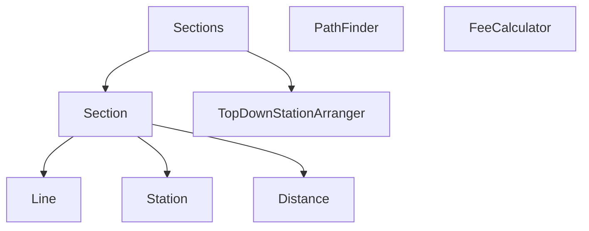

# jwp-subway-path

# 기능 요구사항

- [x] 노선에 역 등록 API
  - [x] 노선에 역이 등록될 때 거리 정보도 함께 포함되어야 합니다.
    - 두 역 사이에 추가할 때, 기존 거리와 양쪽 역의 거리의 합이 일치해야한다.
    - 두 역 사이에 추가할 때, 두 역은 반드시 붙어있어야 한다.
    - 역을 새로 추가할 때, 갈래길이 될 수 없다.
  - [x] 노선에 역이 하나도 등록되지 않은 상황에서 최초 등록 시 두 역을 동시에 등록해야 합니다.

- [x] 노선에 역 제거 API
  - [x] 노선에서 역이 제거될 경우 역과 역 사이의 거리도 재배정되어야 합니다.
  - [x] 노선에 등록된 역이 2개 인 경우 하나의 역을 제거할 때 두 역이 모두 제거되어야 합니다.

- [x] 노선 조회 API 수정
  - [x] 노선에 포함된 역을 순서대로 보여준다.
- [x] 노선 목록 조회 API 수정
  - [x] 존재하는 노선들을 보여준다.

- [x] 최단 경로 조회 API 구현
  - 입력받은 출발역과 도착역으로 최단 경로를 구한다.
  - 최단 경로뿐만 아니라 최단 거리 정보도 함께 응답한다.
  - 환승도 고려한다.
- [x] 요금 조회 기능
  - 경로 조회 시, 요금 정보도 포함하여 응답한다.

# 도메인 객체 설계

# API 설계

[API 설계](API%20statements.http)

# DB TABLE 설계

[DB 테이블 설계](src/main/resources/schema.sql)
