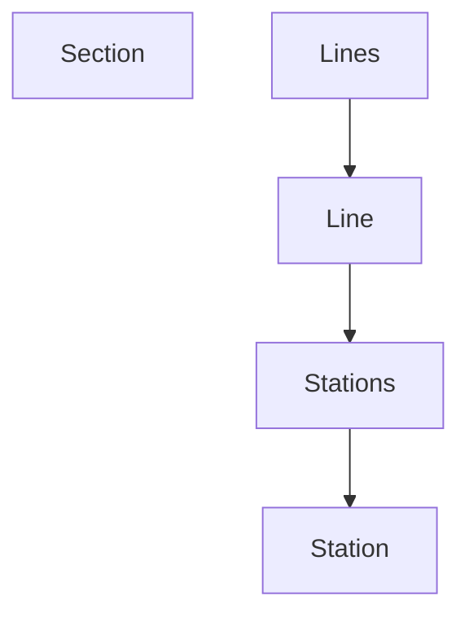

# jwp-subway-path

# API 설계

## 노선 조회

```http request
GET "/lines/{lineId}"

// List<StationResponse>
HTTP Status : 200 OK
[
    {
        "id": ?,
        "name": ?
    },
    {
        ...
    }
]
```

## 노선 목록 조회

```http request
GET "/lines"

// List<LineResponse>
HTTP Status : 200 OK
[
    {
        "id": ?,
        "name": ?,
        "color": ?
    },
    {
        ...
    }
]
```

## 노선에 초기 역 추가

```http request
POST "/lines/{lineId}"

// StationAddRequest (A - B)
{
    "previousStationId" : A,
    "nextStationId" : B,
    "distance" : 11
}
```

## 노선에 역 1개 추가

- 기존 노선에 추가
  - 중간
    lineId, 추가할 stationId, 이전 stationId, 다음 stationId, 이전 station 간의 거리, 다음 station 간의 거리
  - 끝
    lineId, 추가할 stationId, 이전 stationId, 이전 station 간의 거리

```http request
POST "/lines/{lineId}/stations"

// List<StationAddRequest> (A - C - B)
[
   {
        "previousStationId" : A,
        "nextStationId" : C,
        "distance" : 4
    },
    {
        "previousStationId" : C,
        "nextStationId" : B,
        "distance" : 7
    }
]

// response
{
HTTP Status : 201 CREATED
Location: "/lines/{lineId}"
}
```

## 노선에 역 제거 (모든 역 제거 포함)

```http request
DELETE "/lines/{lineId}/stations/{stationId}"

//response
HTTP Status : 204 NO Contentent
```

---

# DB TABLE 설계

```mysql
CREATE TABLE STATION
(
    id   BIGINT NOT NULL AUTO_INCREMENT,
    name VARCHAR(255) NOT NULL UNIQUE,
    PRIMARY KEY (id)
);
```

```mysql
CREATE TABLE LINE
(
    id    BIGINT AUTO_INCREMENT NOT NULL,
    name  VARCHAR(255)          NOT NULL UNIQUE,
    color VARCHAR(255)          NOT NULL UNIQUE,
    PRIMARY KEY (id)
);
```

```mysql
CREATE TABLE SECTION
(
    id         BIGINT AUTO_INCREMENT NOT NULL,
    line_id    BIGINT,
    previous_station_id BIGINT,
    next_station_id BIGINT,
    distance INT NOT NULL,
    PRIMARY KEY (id),
    FOREIGN KEY (line_id) REFERENCES LINE (id) ON DELETE CASCADE,
    FOREIGN KEY (previous_station_id) REFERENCES STATION (id) ON DELETE CASCADE,
    FOREIGN KEY (next_station_id) REFERENCES STATION (id) ON DELETE CASCADE
);
```

---

# 기능 요구사항

- [ ] 노선에 역 등록 API
  - [ ] 노선에 역이 등록될 때 거리 정보도 함께 포함되어야 합니다.
  - [ ] 노선에 역이 하나도 등록되지 않은 상황에서 최초 등록 시 두 역을 동시에 등록해야 합니다.
  - [ ] 노선은 갈래길을 가질 수 없습니다.

- [ ] 노선에 역 제거 API
  - [ ] 노선에서 역이 제거될 경우 역과 역 사이의 거리도 재배정되어야 합니다.
  - [ ] 노선에 등록된 역이 2개 인 경우 하나의 역을 제거할 때 두 역이 모두 제거되어야 합니다.

- [ ] 노선 조회 API 수정
  - [ ] 노선에 포함된 역을 순서대로 보여준다.
- [ ] 노선 목록 조회 API 수정
  - [ ] 존재하는 노션들을 보여준다.

---



---

# TODO

## 1. 노선에 역 추가

### (1) API 레벨의 통합 테스트를 구현하여 내가 구현할 API의 큰 그림을 그리기

- [x] 시나리오 작성(문서화)
- [x] API 설계
  - [ ] API 통합 테스트 작성

### (2) 비즈니스 규칙을 만족하는 설계를 진행하기

- [ ] 도메인 객체 설계
  - [ ] 노선과 역의 관계
  - [ ] 그래프 알고리즘을 어떻게 쓸 것인가

### (3) 설계한 요구사항을 검증할 수 있는 작은 단위의 테스트를 작성하기

### (4) 작은 단위의 테스트를 만족시키는 코드를 구현하기

### (5) 데이터 베이스 연동

- [ ] DB 설계
  - [ ] DDL 정의
  - [ ] Entity 생성 및 수정
