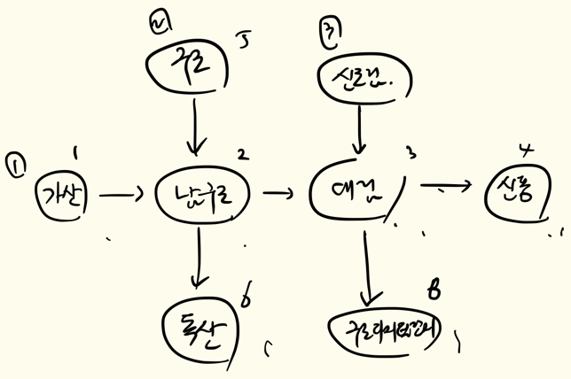

# jwp-subway-path

# 페어 프로그래밍 룰

## 스위치 기준

- [x] 스위치 시간은 20분으로 한다.
- [x] 내비게이터는 전자기기에 손을 대지 않는다.

## 깃 컨벤션

- [x] 기능 목록에 있는 기능 단위로 커밋한다.
- [x] 작동할 수 있는 기능 단위로 커밋한다.
- [x] 커밋 메세지는 아래 키워드를 사용해 기능 목록 그대로 작성한다.
    - feat: 기능 구현을 완료했을 때
    - refactor: 기능의 변화 없이 코드를 변경했을 때
    - test: 테스트 코드만 작성했을 때
    - chore: 패키지 변경 등 사소한 수정사항이 생겼을 때
    - fix: 프로그램의 결함을 수정할 때
    - docs: 문서를 수정할 때

## 구현 계획

- [x] 구현은 다음과 같은 순서로 진행된다.
    1. API 설계 시 사용되는 서비스에 대한 기능 파악
    2. 컨트롤러 기능 구현 
    3. 서비스 기능을 담기 위한 도메인 구현
    4. 영속성에 대한 인터페이스 구현(DIP)
    5. 서비스 기능 구현
    6. 영속성 구현체 생성 테이블 정의

## 기타 룰

- [x] 페어 프로그래밍 방식에 대해 논의하고 싶다면 언제든 이야기한다.
- [x] 집중이 안된다면 페어에게 솔직하게 이야기한다.
- [x] 최소한 2시간에 한 번은 쉬어야 한다.
- [x] 커피챗을 최소 1회 진행한다.

---

# 기능 목록

- [x] 노선에 대한 역 등록 API 구현
  - [x] 역의 위치는 자유롭게 지정할 수 있어야 한다.
  - [x] 노선에 역이 등록될 때 거리 정보도 함께 포함되어야 한다.
    - [x] 거리 정보는 양의 정수로 제한한다.
  - [x] 노선에 역이 하나도 등록되지 않은 상황에서 최초 등록 시 두 역을 동시에 등록해야 한다.
  - [x] 이미 존재하는 역에 대해서만 추가 노선을 지정할 수 있다.
  - [x] 하나의 역은 여러 노선에 등록이 될 수 있다.
  - [x] 노선은 갈래길을 가질 수 없다.
  - [x] 노선 가운데 역이 등록 될 경우 거리 정보를 고려해야 한다.
    - [x] 신규로 등록된 역이 기존 노선의 거리 범위를 벗어날 수 없다.
    - [x] A-B-C 노선에서 B 다음에 D 역을 등록하려고 한다면, B-C역의 거리가 3km인 경우 B-D 거리는 3km 보다 적어야 한다.

- [x] 노선에 역 제거 API 구현
  - [x] 노선에서 역을 제거할 경우 정상 동작을 위해 재배치 되어야 한다.
  - [x] 노선에서 역이 제거될 경우 역과 역 사이의 거리가 재배정된다.
  - [x] 노선에 등록된 역이 2개 인 경우 하나의 역을 제거할 때 두 역이 모두 제거되어야 한다.

- [x] 단일 노선 조회 API 구현
  - [x] 노선에 포함된 역을 순서대로 보여주도록 응답을 개선한다.

- [x] 노선 목록 조회 API 구현
  - [x] 각 노선에 포함된 역을 순서대로 보여주도록 응답을 개선한다.

- [x] 경로 조회 및 요금 조회 API 구현
  - [x] 출발역과 도착역 사이의 최단 거리 경로, 총 거리 정보를 응답한다.
    - [x] 여러 노선의 환승을 고려한다.
  - [x]  경로 조회 시 요금 정보를 포함하여 응답한다.
  - [x] 기본운임(10KM 이내)은 1,250원이다.
    - [x] 이용 거리 초과 시 추가운임을 부과한다.
      - [x] 10KM부터 50KM 까지는 5KM마다 100원이 추가된다.
      - [x] 50KM를 초과하면 8KM마다 100원이 추가된다.

---
### Architecture

--- 

 step 1 기록 

- [x] `Line` 도메인 엔티티를 CRUD용으로도 사용하기도 하고, 비즈니스 로직을 수행할 때 사용하기도 해서 문제가 많았음.
  - [x] 문제점 1: CRUD 시점에는 완전한 도메인 객체가 아님.
  - [x] 문제점 2: 하나의 도메인 엔티티가 여러 개념을 내포하고 있음.
    - [x] 따라서 `LineProperty` 라는 개념을 분리해 ID를 따로 부여했음. 
    - [x] 두 개념(CRUD, 비즈니스 로직용)은 라이프사이클이 다르기에 같은 도메인 엔티티에 정의되면 굉장히 복잡하기 떄문.
- [x] E2E 테스트 환경에서 사용하는 DataSource를 프로덕션 환경에서 사용하는 DataSource로부터 분리.
  - [x] `@SpringBootTest` 어노테이션은 기본적으로 main에 정의된 DataSource를 사용함.
    - [x] 따라서 `@AutoConfigureTestDatabase`를 통해 Embedded H2 DB를 사용하도록 변경.
    - [x] `@JdbcTest`의 경우 내부적으로 이미 해당 어노테이션이 적용되어 있어 문제가 없음.
- [x] 비즈니스 계층에서 발생하는 예외는 모두 커스텀하게 변경 
  - [x] 예측 가능한 예외를 커스텀하게 변경했을 때의 예상되는 장점은 다음과 같음.
    - [x] 예외 후처리가 쉬워짐. 예외마다 다른 처리를 적용할 수 있다.
    - [x] 예외 객체 하나로도 도메인적 표현이 가능해진다.
    - [x] 다른 라이브러리, 프레임워크에서 발생시키는 예외와 겹칠 일이 없다. (제일 중요한 부분이지 않을까)
  - [x] 하지만 커스텀 예외를 사용하면서 생기는 비용도 무시할 수 없음.
    - [x] 예외 객체까지도 관리포인트가 된다.
    - [x] 예외마다 처리가 달라지는 것이 아니라면 이점이 크게 없을 수 있다.
  - [x] 조금 더 고민해보기.
- [x] "SELECT ... WHERE ... IN" 으로 쿼리 개선
  - [x] 여러 번의 쿼리를 단 한 번의 쿼리로 리스트 형태로 받아올 수 있게 됨
- [x] 어플리케이션 레벨에서 조인과 비슷한 기능을 하는 코드 작성
  - [x] N번 쿼리를 보내야 했던 문제를 1번으로 해결
  - [x] 데이터베이스 레벨에서 조인을 하는 방법도 있을 듯 한데.. 관련 DAO나 Row를 또 한번 만들어줘야 하는 문제점
    - [x] 조인할 때마다 새로운 DAO를 만들 것인가?

 step 2 기록 

# step 2 기록
- [x] `ON DELETE RESTRICT` 를 통해 외래키 제약조건 부여
  - [x] `SECTION` 의 참조 필드는 `STATION` 행이 삭제되었다고 해서 같이 삭제가 되거나 NULL 처리를 할 수 없음
    - [x] 도메인 제약조건이 깨지기 때문.
    - [x] 따라서 서비스 로직에서 삭제 방어를 하거나, 외래키에 제약조건을 부여하는 방법이 있을 듯 함.
    - [x] 이번에는 외래키 제약조건을 통해 무결성 보장.
- [x] 현재 `동일한 이름을 가진 STATION을 두 번 생성하려는 경우` 등은 테이블 제약조건에 의해 불가능하다.
  - [x] 즉, 영속성 레벨에서 예외가 발생한다.
  - [x] 이는 다르게 말하면 불필요한 데이터가 영속성 레이어까지 침투한다는 것이다.
  - [x] 영속성 레이어까지 신뢰하지 못하는 데이터를 침투시킬것인가? 그렇다면 서비스에서 모든 무결성 검사를 진행해야 할까? 고민해보기.
- [x] 기본적으로 제공된 코드에 `logback-access.xml`이 존재했고, 이에 대한 의존성도 설정되어 있었음.
  - [x] 찾아보니 컨테이너 레벨에서 로깅 기능을 제공해주는 듯 함.
    - [x] 프로젝트 할 때 도입 고려해보면 좋을 듯.
- [x] 서비스 레이어에서 입력/출력 모델 생성
  - [x] 표현 계층과 비즈니스 계층의 격리를 하기 위함
- [x] `RouteMap` 객체를 재사용 가능하게 변경
  - [x] `Station`을 들고 있는게 아닌, `Section`을 들고 있게 한다면 그래프 탐색에도 재사용 가능
- [x] 경로를 구하는 로직이나, 요금을 계산하는 로직은 우리 시스템의 일부인데 도메인 엔티티 어디에서도 이런 기능은 존재하지 않는다.
  - [x] 즉, `경로 및 요금 로직`을 외부 모듈로 다루니까 이런 문제가 발생함.
  - [x] 하지만 시스템의 핵심 로직이라고 하더라도 무조건 다 도메인 엔티티에 정의되어야 하는 건 아니지 않을까?
    - [x] 예를 들어, 인증도 핵심 로직이지만 도메인 엔티티에 인증 절차를 직접 정의하지는 않음.
- [x] service 테스트에 대한 고민
  - [x] `LineService`는 `LineProperty`, `Station` 데이터가 존재한다는 가정 하에 동작할 수 있다.
    - [x] 그러면 Mocking을 할 것인가? 테스트 코드가 너무 더러워짐.
    - [x] Mocking을 하지 않을 것인가? 그러면 더미 데이터를 매번 생성해줘야 함.
  - [x] 아니면 Fake 객체를 만들 것인가?
- [x] swagger 사용, API 명세 자동화했음.
  - [x] 정말 기본적인 기능만 사용했는데, 추후 프로젝트 시 적절하게 사용한다면 협업이 용이해질 듯 함.

 

