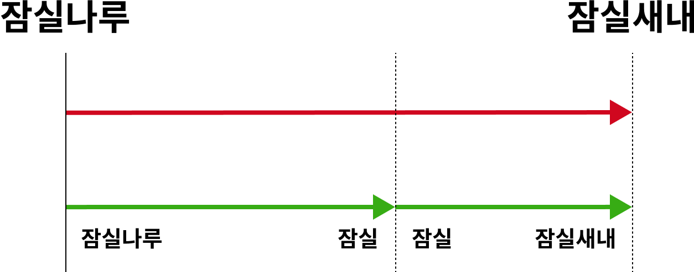

## 용어
- 기점: 노선의 양 끝 중 출발점을 이야기한다. 서울과 가까운 쪽, 북쪽이 우선되는 경우가 많다.
  - `departure`로 표현한다. 
  - 1호선의 기점은 소요산역이다.
  - 7호선의 기점은 장암역이다.
- 종점: 노선의 양 끝 중 도착점을 이야기한다. 서울과 먼 쪽, 남쪽이 우선되는 경우가 많다.
  - `arrival`로 표현한다. 
  - 1호선의 종점은 인천, 광명 등이다.
  - 7호선의 종점은 석남역이다
- 상행: 기점 방향이다. `upper`로 표현한다.
- 하행: 종점 방향이다. `lower`로 표현한다.
- 2호선은 순환하므로 기점과 종점이 같지만, 방향이 있다.
  - 시계 방향을 기본으로 하여 상행은 건대입구->성수 방향, 하행은 뚝섬->성수 방향으로 한다.
- 연결되는 구간: `잠실나루 -> 잠실`, `잠실 -> 잠실새내`와 같이 겹치지 않으면서 연속적이다.
- 겹치는 구간: `잠실나루 -> 잠실새내`, `잠실나루 -> 잠실`과 같이 기존 구간의 일부가 된다.  

## 구현한 API 목록

- 노선에 구간 등록 API
  - POST `/lines/{lineId}/sections`
  - body: 
    ```json
    {
      "upperStationId": 1,
      "lowerStationId": 2,
      "distance": 10
    }
    ```
  - `200 OK`/`400 BAD REQUEST`
- 노선에 역 제거 API
  - DELETE `/lines/{lineId}/stations/{stationId}`
  - `204 NO CONTENT`/`400 BAD REQUEST`
- 최단 경로 조회 API
  - GET `/subway/shortest-path?from={fromStationId}&to={toStationId}`
  - body:
    ```json
    {
      "stations":[
        {
          "id": 9,
          "name":"A"
        },
        {
          "id": 11,
          "name":"C"
        },
        {
          "id": 13,
          "name":"E"
        }
      ],
      "fare": 1250,
      "distance": 7
    }
    ```
  - `200 OK`/`400 BAD REQUEST`
## 기능 목록
- 지하철
  - 역에서 역까지 최단 경로를 알 수 있다.
    - 환승을 포함한 최단 경로를 알아낸다.
- 경로
  - 운임을 구한다.
  - 하행 방향으로 중복 없이 역들을 꺼낸다
  - 거리를 구한다.
- 호선
  - 역들을 알 수 있다.
  - 구간을 추가할 수 있다.
    - 이미 등록된 구간이면 예외를 던진다.
    - 비연결 구간을 추가할 때
      - 구간이 하나라도 있으면 예외를 던진다
    - 기점 앞에 추가할 수 있다.
      - 추가하는 구간의 기점 쪽이 연결되면, 기존 역의 하행 쪽에 연결한다.
    - 종점 뒤에 추가할 수 있다.
      - 추가하는 구간의 종점 쪽이 연결되면, 기존 역의 상행 쪽에 연결한다.
    - 역 사이에 추가할 수 있다.
      - 기존 구간의 상행, 하행 역과 연결하고 기존 구간을 제거해야 한다.
  - 역을 제거할 수 있다.
    - 해당 역을 포함하는 구간이 제거된다.
  - 기점부터 종점까지의 역을 중복 없이, 순서 있게 알 수 있다.
- 구간
  - 두 역이 모두 있어야 한다.
  - 어떤 구간과 연결되는지 알 수 있다. 
    - 서로 대칭인 경우는 연결된 경우가 아니다.   
      (`잠실나루` - `잠실`, `잠실` - `잠실나루`)
  - 어떤 구간과 겹치는지 알 수 있다.
  - 어떤 역을 포함하는지 알 수 있다.
  - 한 구간을 일부분들로 쪼갠다.
    - 상행 역 기준으로 정렬되어 반환된다.
    - 제공한 부분이 일부가 아니면 예외를 던진다.
      - 거리가 기존 구간을 넘으면 안된다. 
    - > 
  - 이어지는 두 구간을 하나로 병합한다.
    - 이어지지 않으면 예외를 던진다.
  - 기점 쪽 역을 알 수 있다.
  - 종점 쪽 역을 알 수 있다.
  - 구간의 거리를 알 수 있다.
- 거리
  - 거리는 양수여야 한다.
  - 거리끼리 차를 구한다.
  - 거리끼리 더한다.
  - 어느 거리가 더 긴지 알 수 있다.
  - 운임을 구한다.
- 운임 정책
  - 운임을 계산한다.
    - `10km` 이내는 1,250원
    - `10km~50km` `5km` 당 100원
    - `50km` 초과 시 `8km` 당 100원
- 역
  - 이름이 같으면 같은 역으로 취급한다
