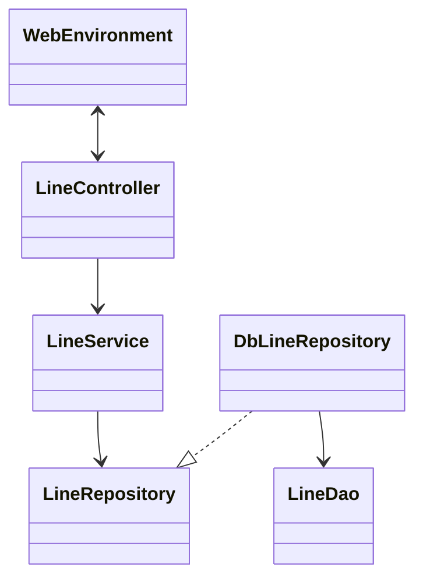
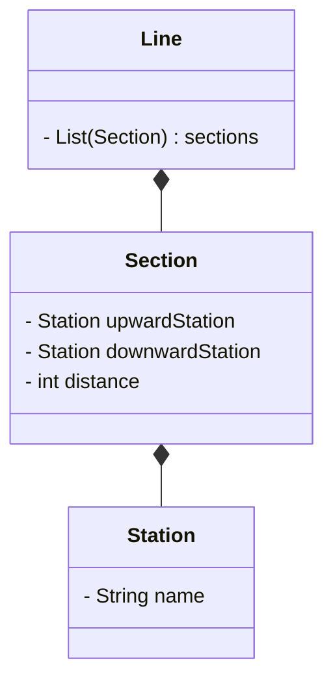
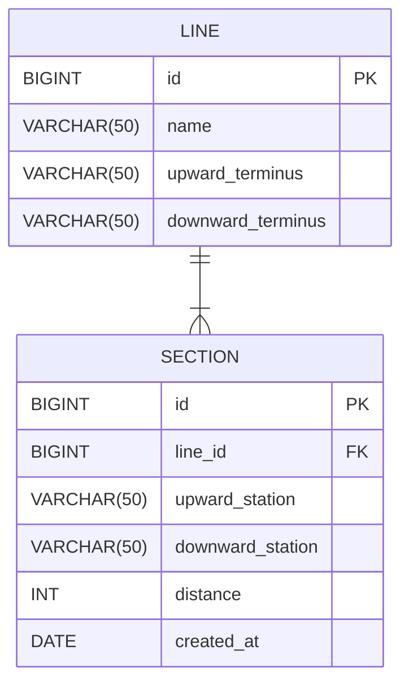

# 프로그램 개요
지하철 노선도를 관리하는 프로그램입니다.
노선과 역을 추가, 제거할 수 있습니다.
## 용어 설명
- 역 : 노선을 따라 지정된 지점
- 노선 : 여러 역이 연결된 경로
- 구간 : 역과 역 사이

# 프로그램 설계

### 클래스 다이어그램 - MVC

### 클래스 다이어그램 - 도메인

### Entity-Relationship Diagram

# API 명세서
Swagger link : http://localhost:8080/swagger-ui/index.html#/
(SubwayApplication 실행 후 접속)

# 기능 목록

### Line
- [x] 노선을 생성한다.
  - [x] 구간을 생성한다.
- [x] 노선에 역을 추가한다.
  - [x] 예외) 이미 역이 존재하는 경우
  - [x] 예외) 이웃역이 존재하지 않을 경우
  - [x] 역이 위치할 곳의 구간을 생성한다.
    - [x] 예외) 새로운 구간의 거리가 기존 구간의 거리보다 크거나 같은 경우
- [x] 노선에서 역을 제거한다.
  - [x] 예외) 노선에 존재하지 않는 역인 경우
  - [x] 예외) 노선에 2개의 역만 존재하는 경우
  - [x] 구간을 새로 생성한다.
    - [x] 제거한 역이 포함된 구간을 노선에서 삭제한다.
      - [x] 역이 종점인지 아닌지 판단한다.
        - [x] 제거한 역이 종점역이 아닌 경우, 이웃하고 있던 두 역이 포함된 구간을 노선에 추가한다.

### Section
- [x] 상행역, 하행역과 거리를 갖는다.
- [x] 남은 거리를 계산한다.
- [x] 특정 역의 포함 여부를 반환한다.
- [x] 상행역인지 여부를 반환한다.
- [x] 하행역인지 여부를 반환한다.

### Station
- [x] 역의 이름을 갖는다.
