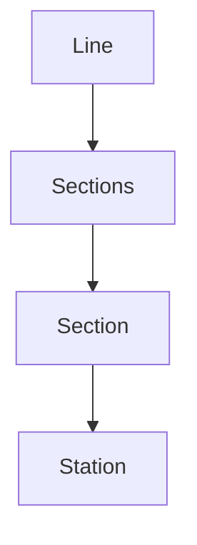

# jwp-subway-path

## 도메인

### Line

- Long:id
- String:Name
- Sections:sections

### Sections

- List<Section> sections

### Section

- Long:id
- Station:upStation
- Station:downStation
- int:distance

### Station

- Long:id
- String:stationName

## 요구사항

### 등록 API 신규 구현

- [x] 역 생성
    - stationName
- [x] 라인 생성
    - lineName
    - 이름이 존재하면 예외처리
- [x] 구간 생성
    - lineId
    - upStationId
    - downsStationId
    - distance
    - 처음인경우
      - upStation, downStation 둘다 맞는 section이 없는 경우 둘을 잇는 섹션 생성
    - 종점인 경우 그냥 생성하면 됨
        - upStation, downStation 한쪽만 있는 경우 있는거랑 새로운거랑 잇는 섹션 생성
  - 중간에 넣는 경우
    - 넣는 역이 downStation인 경우
      - upStation으로 Section을 찾아 downStation을 넣는역으로 update
        - distance도 새로운 distance로 변경
        - 넣은 역과 원래 downStation역을 이어주는 Section을 생성, distance는 (원래 distance - 넣은 distance)
    - 넣는 역이 upStation인 경우 위와 반대로하면 됨

### 제거 API 신규

- [x] 역 제거
  - stationId
  - 종점인 경우 (한쪽 station만 있는 경우) 해당 station과 함께 제거
  - 중간역 제거하는 경우 중간역이 downStation인 section을 찾아 downStation과 distance를 업데이트 후 중간역이 upStation인 section을 제거
  - 역이 2개인 경우 두 역 모두 제거

### 노선 조회 API 수정

- [x] 노선에 포함된 역 순서대로 조회
  - lineId
  - 해당 노선의 첫번째 역을 찾아서
    - upStation에 자신의 역밖에 없는 역이 처음 역 
  - Map 형태에 Station 마다 다음 section을 둬서 순서대로 조회
    - Map<String, Section>

### 노선 목록 조회 API 수정

- [x] 노선(Line) 전체 목록 조회

### 경로 조회 API 구현
- [x] 출발역과 도착역 사이의 최단 거리 경로를 구하는 API를 구현
  - from
  - to
  - 최단 거리 경로와 함께 총 거리 정보를 함께 응답
  - 한 노선에서 경로 찾기 뿐만 아니라 여러 노선의 환승도 고려
  - 갈 수 없는 경우 예외 처리
- [x] 경로 조회 시 요금 정보를 포함하여 응답

### 데이터베이스 설정을 프로덕션과 테스트 분리
- [x] 프로덕션의 데이터베이스는 로컬에 저장될 수 있도록 설정
- [x]테스트용 데이터베이스는 인메모리로 동작할 수 있도록 설정
