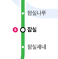

# jwp-subway-path

# 구현할 기능 목록

- 노선에 역 등록 API 신규 구현
    - 역 등록 요청 {HTTP method: POST, URI: "/lines/{lineId}/station", body: upperStation, lowerStation, distance}
      ```json
        {
          "upperStation": 1,
          "lowerStation": 2,
          "distance": 10
        }
        ```
    - 응답 {Status Code: `OK`} // CREATED 혹은 NO CONTENT를 반환하는 것을 고려해보기

- 노선에 역 제거 API 신규 구현
    - 요청 {HTTP method: DELETE, URI: "/lines/{lineId}/station", body stationId}
        ```json
        {
          "id": 1
        }
        ```
    - 응답 {Status Code: `NO_CONTENT`}



- 도메인
    - 노선
        - 역을 등록한다
            - 노선에 등록되는 역의 위치는 자유롭게 지정할 수 있다.
                - 역과 역 사이에 역을 등록할 수 있다.
                - 종점의 앞이나 뒤에도 역을 등록할 수 있다.
            - 노선에 역이 등록될 때 거리 정보도 함께 포함되어야 한다.
                - 인접한 역들과의 거리 정보가 저장되어야 한다.
                - 거리 정보는 양의 정수로 제한한다.
            - 노선에 역이 하나도 등록되지 않은 상황에서 최초 등록 시 두 역을 동시에 등록해야 한다.
            - 노선은 갈래길을 가질 수 없다.
            - 노선 가운데 역이 등록될 경우 거리 정보를 고려해야 한다.
              - 역 사이에 새로운 역을 등록할 경우 기존 역 사이 길이보다 크거나 같으면 등록할 수 없다.
        - 역을 제거한다
            - 노선에서 역을 제거할 경우 정상 동작을 위해 재배치 되어야 한다.
            - 노선에서 역이 제거될 경우 역과 역 사이의 거리도 재배정되어야 한다.
            - 노선에 등록된 역이 2개인 경우 하나의 역을 제거할 때 두 역이 모두 제거되어야 한다.
    - 역
      - 이름이 같으면 같은 역으로 취급한다

- API
  - 노선 조회
    - 노선 조회 시 노선에 등록된 역을 순서대로 반환한다.
  - 노선 목록 조회
    - 노선 목록 조회 시 노선들에 등록된 역을 순서대로 반환한다.

- 질문 목록
  - db를 수정할 때 db의 모든 항목을 지워버리고 최신 버전으로 다시 추가하는 방법 vs 수정된 항목만 업데이트하는 방법
  - Repository 계층이 존재할 때 Service에서 Repository를 통해서만 DB에 접근할 수 있는지


# 리팩토링 목록
- Line 내의 간선 콜렉션은 Section 클래스로 분리하기
- 각 계층이 주고 받는 데이터 일관적으로 정리하기(Dto, Entity 등)
- 역 등록 API 일원화하기
- 단위 테스트 상세하게 추가하기

# 구현할 기능 목록 - 2단계
- 경로 조회 API 구현
  - 출발역과 도착역 사이의 최단 거리 경로를 구한다
    - 한 노선뿐만 아니라 여러 노선의 환승을 고려하여야 한다
    - 최단 경로 조회시 jgrapht 라이브러리를 활용하여 구현한다
  - 최단 거리 경로의 거리 정보를 구한다
  - 최단 거리 경로의 역과 호선 정보를 구한다
  - 경로 조회 시 요금 정보를 포함하여 응답한다
  - 요청 {HTTP method: GET, URI: "/subway/path", body: from, to}
  ```json
    {
        "from": 1, 
        "to": 2 
    }
  ```

  - 응담 {Status Code: OK, body: sections(line, from, to, distance), whole-distance, fare}  
  ```json
    {
        "sections": {
            {
              "line": 1
              "from": "잠실",
              "to": "잠실새내",
              "distnace": 8,
            },
            {
              "line": 1
              "from": "잠실새내",
              "to": "강변",
              "distnace": 6,
            },
              {
              "line": 2
              "from": "강변",
              "to": "구의",
              "distnace": 7,
            }
        },
        "whole-distance": 21,
        "fare": 1250 
    } 
  ```
  
- 요금 조회 기능
  - 기본운임(10km 이내): 1250원
  - 이용 거리 초과 시 추가운임 부과
    - 10km~50km: 5km까지마다 100원 추가
    - 50km 초과: 8km까지마다 100원 추가

- 최단 경로 조회시 jgrapht 라이브러리를 활용하여 구현한다
  - 모든 지하철 노선도를 그래프 형태로 구현한다
  - vertex는 하나의 역을 의미한다. (station)
  - edge는 두 개 역 사이의 구간을 의미하며 두 개 역과 둘 사이의 거리, 포함된 노선 id를 가진다. (section)

- 프로덕션과 테스트의 데이터베이스를 다르게 설정한다
  - 프로덕션의 데이터베이스는 로컬에 저장된다
  - 테스트용 데이터베이스는 인메모리도 동작한다

- 2단계 질문 목록
  - Entity처럼 쓰이는 도메인과 DB 테이블 구조와는 상관없는 도메인을 혼용하는 것에 대해 어떻게 생각하는지
  - 존재하지 않는 Station을 find하도록 dao에 요청했을 때 예외가 발생하는 이유?(InvokationTargetException)