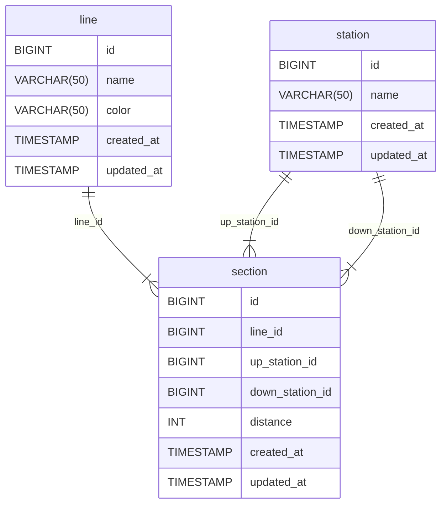

# 요구사항

- [x] 노선에 역 등록 API 신규 구현
- [x] 노선에 역 제거 API 신규 구현
- [x] 노선 조회 API 수정
    - 노선에 포함된 역을 순서대로 보여주도록 응답을 개선합니다.
- [x] 노선 목록 조회 API 수정
    - 노선에 포함된 역을 순서대로 보여주도록 응답을 개선합니다.


- [x] 데이터베이스 설정을 프로덕션과 테스트를 다르게 한다.
    - [x] 프로덕션의 데이터베이스는 로컬에 저장될 수 있도록 설정
    - [X] 테스트용 데이터베이스는 인메모리로 동작할 수 있도록 설정


- [x] 경로 조회 API 구현
    - [x] 출발역과 도착역 사이의 최단 거리 경로를 구하는 API를 구현한다.
    - [x] 최단 거리 경로와 함께 총 거리 정보를 함께 응답한다.
    - [x] 한 노선에서 경로 찾기 뿐만 아니라 여러 노선의 환승도 고려한다.


- [x] 요금 조회 기능 추가
    - [x] 경로 조회 시 요금 정보를 포함하여 응답한다.
    - [x] 요금은 다음과 같은 기준으로 산정된다.
        - 기본운임(10㎞ 이내): 기본운임 1,250원
        - 이용 거리 초과 시 추가운임 부과
        - 10km~50km: 5km 까지 마다 100원 추가
        - 50km 초과: 8km 까지 마다 100원 추가

- [x] 노선별 추가 요금 정책 반영
- [ ] 연령별 요금 할인 정책 반영
- [ ] 경로 조회 API 변경

---

# 용어 사전

| 한글명 | 영문명         | 설명                 |
|-----|-------------|--------------------|
| 노선  | line        | 구간의 모음, 이름을 가진다    |
| 역   | station     | 이름을 가진다            |
| 구간  | section     | 상행역, 하행역, 거리를 가진다. |
| 상행역 | upStation   | 위에 존재하는 역이다.       |
| 하행역 | downStation | 아래에 존재하는 역이다.      |
| 거리  | distance    | 두 역 사이의 거리다.       |

---

# 기능목록

## 노선에 역을 등록

- [x] 역 최초 등록시, 두 역을 동시에 등록해야 한다.
- [x] 역 등록시 출발역, 도착역, 거리 정보를 입력한다.
    - [x] 상행역과 하행역은 다른 역이어야 한다.
    - [x] 거리는 양의 정수이다.
    - [x] 해당 노선에 대한 구간 정보가 이미 존재할 경우
        - [x] 상행역과 하행역 중 하나가 노선에 등록되어 있어야한다.
    - [x] 이미 존재하는 구간 사이에 역을 추가할 수 있다.
        - [x] 거리 정보를 고려해야 한다.
            - [x] 입력된 거리는 기존 구간의 거리보다 작아야한다.
            - [x] 거리는 양의 정수이다.
- [x] 하나의 역은 여러 노선에 등록될 수 있다.

## 노선에 역을 제거

- [x] 노선에 등록된 역이 2개일 경우, 하나의 역 제거시 두 역 모두 제거된다.
- [x] 중간 역이 제거될 경우, 양 옆 역의 거리를 합해준다.

---

# API 명세

## Line API

| Method | URL                                  | HttpStatus | Description         |
|--------|--------------------------------------|------------|---------------------|
| GET    | /lines                               | 200        | 전체 노선 목록을 조회한다.     |
| GET    | /lines/{lineId}                      | 200        | 해당 노선을 조회한다.        |
| POST   | /lines                               | 201        | 노선을 생성한다.           |
| PUT    | /lines/{lineId}                      | 200        | 해당 노선 정보를 수정한다.     |
| DELETE | /lines/{lineId}                      | 204        | 해당 노선을 삭제한다.        |
| POST   | /lines/{lineId}/stations             | 201        | 해당 노선에 구간을 추가한다.    |
| DELETE | /lines/{lineId}/stations/{stationId} | 204        | 해당 노선에서 해당 역을 삭제한다. |

### GET /lines

#### Request

NONE

#### Response

Body

```json
{
  "lines": [
    {
      "id": 1,
      "name": "2호선",
      "color": "GREEN",
      "stations": [
        {
          "id": 1,
          "name": "역삼역"
        },
        {
          "id": 2,
          "name": "삼성역"
        },
        {
          "id": 3,
          "name": "잠실역"
        }
      ]
    },
    {
      "id": 2,
      "name": "3호선",
      "color": "ORANGE",
      "stations": [
        {
          "id": 1,
          "name": "교대역"
        },
        {
          "id": 2,
          "name": "고속터미널역"
        },
        {
          "id": 3,
          "name": "신사역"
        }
      ]
    }
  ]
}
```

### GET /lines/{lineId}

#### Request

NONE

#### Response

Body

```json
{
  "id": 1,
  "name": "2호선",
  "color": "GREEN",
  "stations": [
    {
      "id": 1,
      "name": "역삼역"
    },
    {
      "id": 2,
      "name": "삼성역"
    },
    {
      "id": 3,
      "name": "잠실역"
    }
  ]
}
```

### POST /lines

#### Request

BODY

```json
{
  "name": "2호선",
  "color": "GREEN"
}
```

#### Response

BODY

```json
{
  "id": 1,
  "name": "2호선",
  "color": "GREEN"
}
```

### PUT /lines/{lineId}

#### Request

BODY

```json
{
  "name": "2호선",
  "color": "GREEN"
}
```

#### Response

NONE

### POST /lines/{lineId}/stations

#### Request

Body

```json
{
  "upStation": 1,
  "downStation": 2,
  "distance": 15
}
```

#### Response

Body

```json
{
  "id": 1,
  "name": "2호선",
  "color": "GREEN",
  "stations": [
    {
      "id": 1,
      "name": "역삼역"
    },
    {
      "id": 2,
      "name": "삼성역"
    },
    {
      "id": 3,
      "name": "잠실역"
    }
  ]
}
```

### DELETE /lines/{lineId}

#### Request

NONE

#### Response

NONE

### DELETE /lines/{lineId}/stations/{stationId}

#### Request

NONE

#### Response

NONE

---

## Station API

| Method | URL                      | HttpStatus | Description                |
|--------|--------------------------|------------|----------------------------|
| GET    | /stations                | 200        | 전체 역 목록을 조회한다.             |
| GET    | /stations/{id}           | 200        | 해당 역을 조회한다.                |
| POST   | /stations                | 200        | 해당 역을 등록한다.                |
| PUT    | /stations/{id}           | 200        | 해당 역을 수정한다.                |
| DELETE | /stations/{id}           | 204        | 해당 역을 삭제한다.                |
| GET    | /stations/shortest-route | 200        | 최단거리경로, 총 거리정보, 요금정보를 구한다. |

### GET /stations

#### Request

NONE

#### Response

Body

```json
{
  "stations": [
    {
      "id": 1,
      "name": "역삼역"
    },
    {
      "id": 2,
      "name": "삼성역"
    },
    {
      "id": 3,
      "name": "잠실역"
    }
  ]
}
```

### GET /stations/{stationId}

#### Request

NONE

#### Response

Body

```json
{
  "id": 1,
  "name": "역삼역"
}
```

### POST /stations

#### Request

BODY

```json
{
  "name": "역삼역"
}
```

#### Response

BODY

```json
{
  "id": 1,
  "name": "역삼역"
}
```

### PUT /stations/{stationId}

#### Request

BODY

```json
{
  "id": 1,
  "name": "건대역"
}
```

#### Response

NONE

### DELETE /stations/{stationId}

#### Request

NONE

#### Response

NONE

### GET /stations/shortest-route

#### Request

```json
{
  "sourceStation": 1,
  "targetStation": 3
}
```

#### Response

Body

```json
{
  "stations": [
    {
      "id": 1,
      "name": "역삼역"
    },
    {
      "id": 2,
      "name": "삼성역"
    },
    {
      "id": 3,
      "name": "잠실역"
    }
  ],
  "distance": 10,
  "fare": 1250
}
```

---

# DB 테이블 구조


