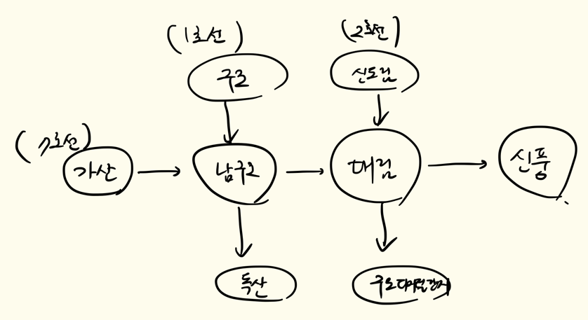

안녕하세요 빙봉!

main -> resource 아래에 sql 파일을 아래와 같이 정의해놓으면, 통합 테스트시 테스트가 자꾸 깨져서

해당 http 파일을 작성할 때에만 사용하였습니다!

아래 사진은 테스트 데이터의 구조를 그림으로 표현한 것입니다.

```sql
INSERT INTO station(name) VALUES('가산'), ('남구로'), ('대림'), ('신풍'), ('구로'), ('독산'), ('신도림'), ('구로디지털단지');
INSERT INTO line(name, color) VALUES('7호선', 'bg-olive-600'), ('1호선', 'bg-blue-600'), ('2호선', 'bg-green-600');
INSERT INTO section(line_id, distance, previous_station_id, next_station_id) VALUES(1, 10, 1, 2),
                                                                                   (1, 10, 2, 3),
                                                                                   (1, 10, 3, 4),
                                                                                   (2, 10, 5, 2),
                                                                                   (2, 10, 2, 6),
                                                                                   (3, 10, 7, 3),
                                                                                   (3, 10, 3, 8);
```

